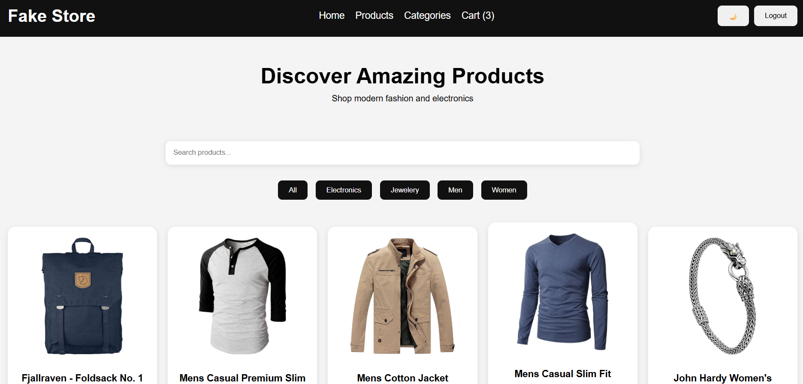
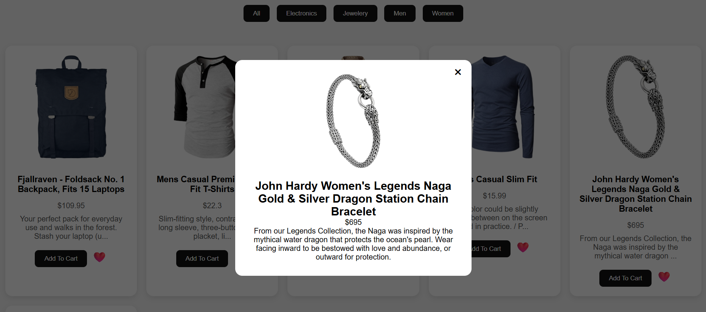
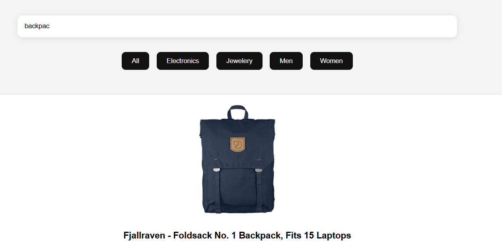
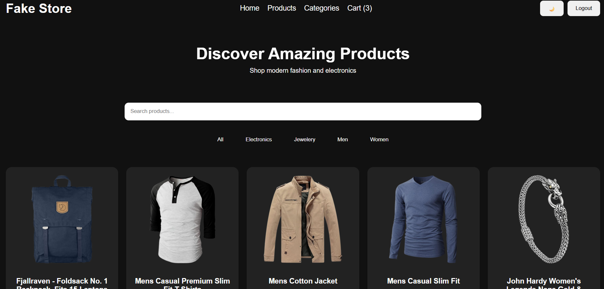
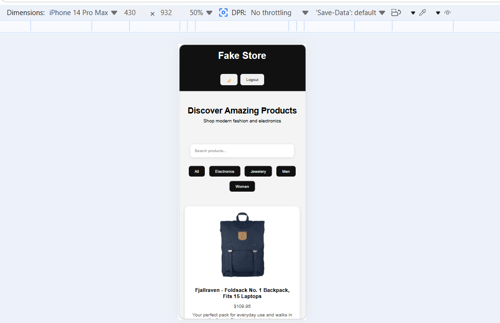

# Fake Store Project 🛒

A modern and responsive e-commerce web application built using JavaScript and Fake Store API.

## Features 🚀

- Fetch and display products dynamically using Fake Store API.
- Responsive design for mobile, tablet, and desktop screens.
- Product search functionality.
- Category filtering system.
- Product modal popup.
- Add to Cart functionality with LocalStorage.
- Favorites system ❤️
- Dark Mode 🌙
- Pagination system for better performance.
- Login / Logout simulation using LocalStorage.
- Toast notifications for user interactions.

## Tech Stack 🛠️

- HTML5
- CSS3 (Flexbox & Grid)
- JavaScript (ES6+)
- Fake Store API

## Concepts Practiced 💡

- DOM Manipulation
- Fetch API
- Async / Await
- Array Methods (map, filter, slice)
- Event Handling
- LocalStorage
- Responsive Design
- Pagination Logic

## Preview 📸

### Home Page


### Product Modal


### Search Feature


### Dark Mode


### Mobile Responsive


## How to Run 💻

1. Clone the repository:

```bash
https://github.com/ayaalsaudi6-blip/fakestore.git

2. Open `index.html` in your browser.

## Future Improvements 📌

- Backend Integration
- Real Authentication
- Payment Gateway
- React Version
- Wishlist Page